# GEKO: Gradient-Efficient Knowledge Optimization

<p align="center">
  
</p>

<p align="center">
  
  
  
</p>

<p align="center">
  <b>A plug-and-play training framework that makes LLM training more efficient.</b>
</p>

> *Like LoRA revolutionized fine-tuning, GEKO revolutionizes training.*

---

## Key Insight

<p align="center">
  
</p>

Traditional training treats all samples equally:

$$\mathcal{L}_{standard} = \frac{1}{N} \sum_{i=1}^{N} \ell(x_i, y_i)$$

**GEKO** weights samples by their learning value:

$$\mathcal{L}_{GEKO} = \frac{1}{N} \sum_{i=1}^{N} w_i \cdot \ell(x_i, y_i) \quad \text{where} \quad w_i = f(bucket_i)$$

---

## Installation

```bash
pip install geko
```

---

## Quick Start

```python
from geko import GEKOTrainer, GEKOConfig
from transformers import AutoModelForCausalLM, AutoTokenizer

model = AutoModelForCausalLM.from_pretrained("gpt2")
tokenizer = AutoTokenizer.from_pretrained("gpt2")

trainer = GEKOTrainer(
    model=model,
    tokenizer=tokenizer,
    train_dataset=your_dataset,
)

trainer.train()
print(trainer.get_efficiency_report())
```

---

## The GEKO Algorithm

### Sample Partitioning

```mermaid
flowchart TD
    A[Sample] --> B{Correct?}
    B -->|Yes| C{Confident & High Quality?}
    B -->|No| D{High Confidence?}
    C -->|Yes| E[🔵 FREEZE<br/>w = 0<br/>Never train]
    C -->|No| F[🟢 LIGHT<br/>w = 0<br/>Low priority]
    D -->|Yes| G[🔴 HARD<br/>w = 3<br/>Highest priority]
    D -->|No| H[🟠 FOCUS<br/>w = 1<br/>Medium priority]

    style E fill:#3498db,color:#fff
    style F fill:#2ecc71,color:#fff
    style G fill:#e74c3c,color:#fff
    style H fill:#f39c12,color:#fff
```

<p align="center">
  
</p>



### Bucket Definitions

| Bucket | Condition | Weight | Description |
|:------:|:----------|:------:|:------------|
| 🔵 **FREEZE** | $correct \land c > 0.85 \land q > 0.80$ | $w = 0$ | Mastered |
| 🟢 **LIGHT** | $correct \land (c \leq 0.85 \lor q \leq 0.80)$ | $w = 0$ | Uncertain |
| 🟠 **FOCUS** | $\neg correct \land c \leq 0.60$ | $w = 1$ | Wrong |
| 🔴 **HARD** | $\neg correct \land c > 0.60$ | $w = 3$ | **Confident-wrong** |

---

## Mountain Curriculum

<p align="center">
  
</p>


### Five Phases


| Phase | Progress | HARD | FOCUS | LIGHT | Strategy |
|:------|:--------:|:----:|:-----:|:-----:|:---------|
| WARMUP | 0-15% | 1 | 2 | 3 | Build foundation |
| ASCENT | 15-35% | 2 | 3 | 1 | Increase difficulty |
| PEAK | 35-65% | 5 | 2 | 0 | Maximum learning |
| DESCENT | 65-85% | 2 | 3 | 1 | Reduce difficulty |
| CONSOLIDATE | 85-100% | 1 | 2 | 3 | Reinforce |

---

## Q-Value Learning

<p align="center">
  
</p>

Each sample maintains a Q-value representing "learnability":

$$Q_{t+1}(s) = (1 - \alpha) \cdot Q_t(s) + \alpha \cdot \left(1 - \frac{\ell_t(s)}{\ell_{max}}\right)$$

```mermaid
graph LR
    A[Sample Loss ↓] --> B[Q-Value ↑]
    B --> C{Q > threshold?}
    C -->|Yes| D[Move to FREEZE]
    C -->|No| E[Stay trainable]

    style D fill:#3498db,color:#fff
    style E fill:#f39c12,color:#fff
```



---

## Efficiency Analysis

<p align="center">
  
</p>

### Compute Savings Over Time


### Training Progression

| Epoch | FREEZE | LIGHT | FOCUS | HARD | **Compute Saved** |
|:-----:|:------:|:-----:|:-----:|:----:|:-----------------:|
| 1 | 0% | 20% | 60% | 20% | 0% |
| 2 | 15% | 25% | 45% | 15% | **15%** |
| 3 | 35% | 30% | 25% | 10% | **35%** |
| 5 | 55% | 25% | 15% | 5% | **55%** |
| 10 | 80% | 15% | 4% | 1% | **80%** |

---

## Architecture

<p align="center">
  
</p>


---

## Theoretical Guarantees

### Convergence

Under standard assumptions, GEKO converges:

$$\sum_{t=1}^{\infty} w_t^{(s)} = \infty \quad \forall s \notin \text{FREEZE}$$

### Efficiency Bound

$$T_{GEKO} \leq T_{standard} \cdot (1 - \mathbb{E}[F])$$

Where $\mathbb{E}[F]$ = expected freeze fraction.

---

## Results

<p align="center">
  
</p>

| Metric | Standard | GEKO | Improvement |
|:-------|:--------:|:----:|:-----------:|
| Training Time | 100% | 50-70% | **30-50% faster** |
| Compute Cost | 100% | 50-70% | **30-50% cheaper** |
| Final Loss | $\ell^*$ | $\leq \ell^*$ | Equal or better |

---

## Citation

```bibtex
@software{geko2026,
  author = {Syed Abdur Rehman},
  title = {GEKO: Gradient-Efficient Knowledge Optimization},
  year = {2026},
  url = {https://github.com/ra2157218-boop/GEKO}
}
```

---

## License

Apache 2.0

---

<p align="center">
  <b>GEKO</b> - Train smarter, not harder.
</p>
